# Limpieza del Entorno - Previo al Despliegue de Topologias - Laboratorio 4

## Objetivo:

Eliminar la Topologia creada durante el Laboratorio 3 en **Server1, Server2 y Server3**, dejando los servidores preparados para desplegar las nuevas topologías del Laboratorio 4.

La limpieza se ejecuta de forma centralizada desde **Server4** mediante el script:

```bash
clean_up_environment.sh
```

> **Importante:** `ens3` y `ens4` son interfaces físicas que forman parte de la infraestructura base del VNRT y **no deben eliminarse**. La limpieza elimina únicamente los recursos creados en el laboratorio 3.

---

## 1. Verificamos el estado inicial

Antes de realizar la limpieza del entorno, verificamos que los recursos de la topología anterior todavía estén presentes.

Ejecutamos los siguientes comandos en cada server del VNRT:

### Server1:

```bash
sudo ovs-vsctl show
docker ps
ip -br link
```

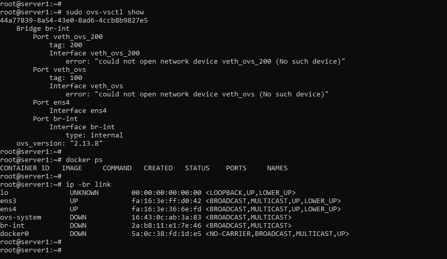

### Server2:

```bash
sudo ovs-vsctl show
pgrep -af qemu
ip -br link
```

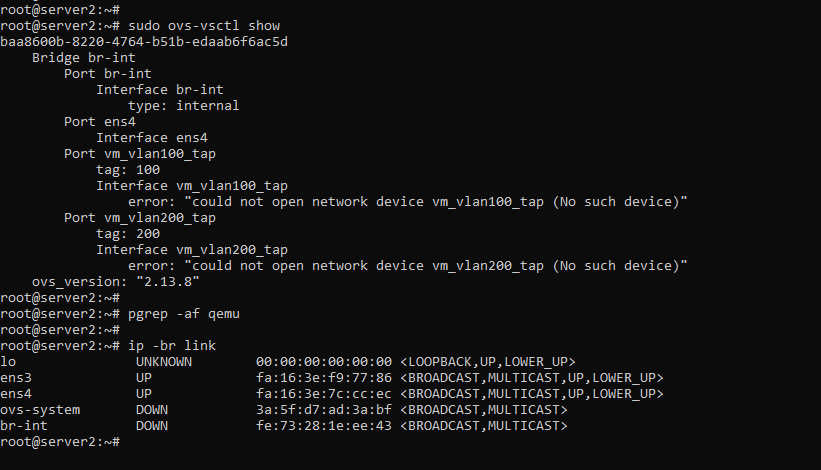

### Server3:

```bash
sudo ovs-vsctl show
ip -br link
sudo ip netns list
sudo iptables -L -n -v
sudo iptables -t nat -L -n -v
```

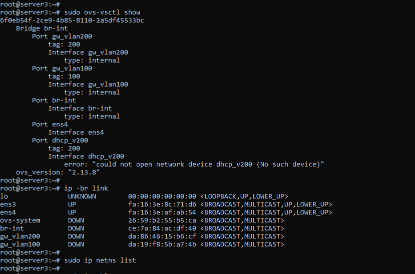

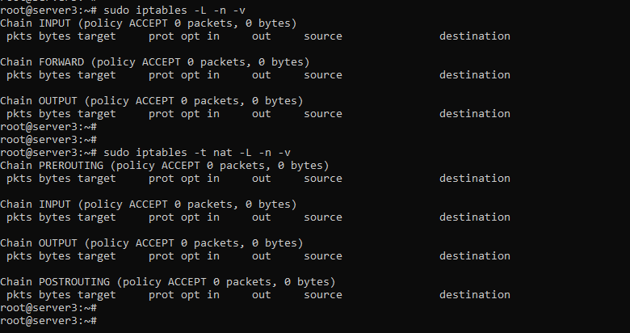

---

## 2. Ejecutamos la limpieza desde Server4

Desde Server 4 , Nos Ubicamos en la ruta del directorio donde se encuentra el script "clean_up_environment.sh" :

```bash
cd TEL141_L4_20182758/DEV/clean_up_environment
```

Damos permisos de ejecución para el script:

```bash
chmod +x clean_up_environment.sh
```

Ejecutamos el script:

```bash
./clean_up_environment.sh
```

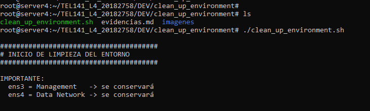

### Limpieza Server1:

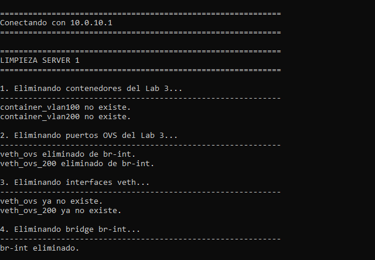

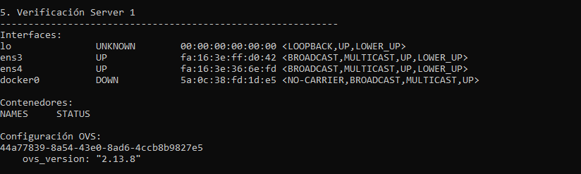

### Limpieza Server2:

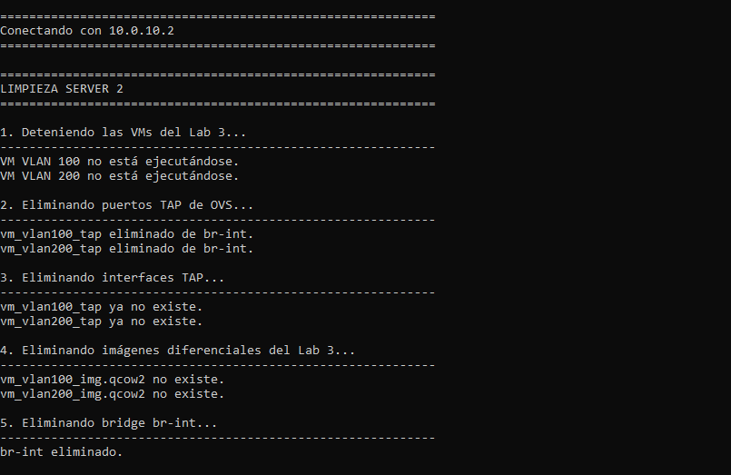

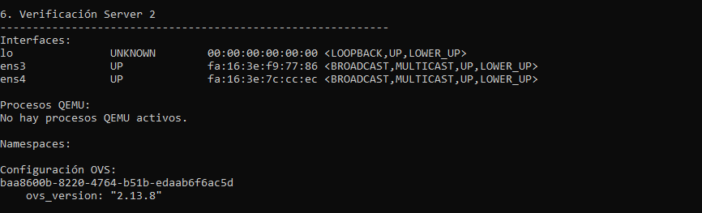

### Limpieza Server3:

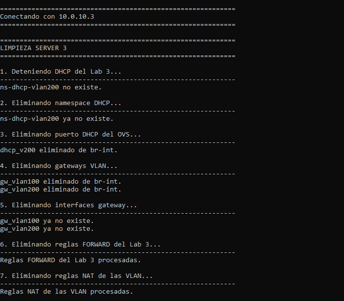

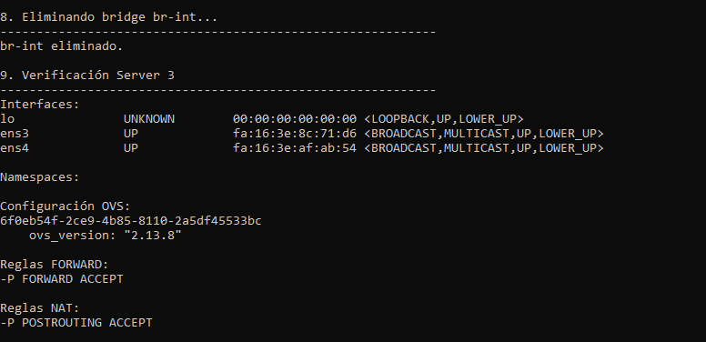

### Limpieza Completada:

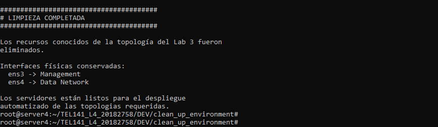

El script realizó la limpieza de los componentes (contenedores, VMs, enlaces veth , interfaces TAP , bridges OVS , namespaces , servidores DHCP, reglas IP Tables, etc) presentes en los Server1, Server2 y Server3 , que en conjunto formaban la topologia o slice desplegado en el laboratorio 3. (validando también si estos aún existían o No , al momento de eliminarlos)

---

## 3. Verificamos el estado final

Una vez finalizada la limpieza el entorno, comprobamos que los componentes , enlaces, bridges ovs , etc de la topología anterior hayan sido eliminados.

Nuevamente ejecutamos los siguientes comandos en los servers:

### Server1

```bash
sudo ovs-vsctl show
docker ps
ip -br link
```

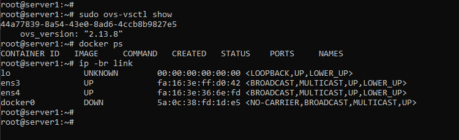

### Server2

```bash
sudo ovs-vsctl show
pgrep -af qemu
ip -br link
```

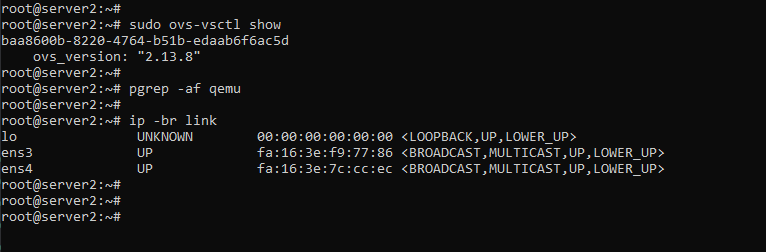

### Server3

```bash
sudo ovs-vsctl show
ip -br link
sudo ip netns list
sudo iptables -L -n -v
sudo iptables -t nat -L -n -v
```

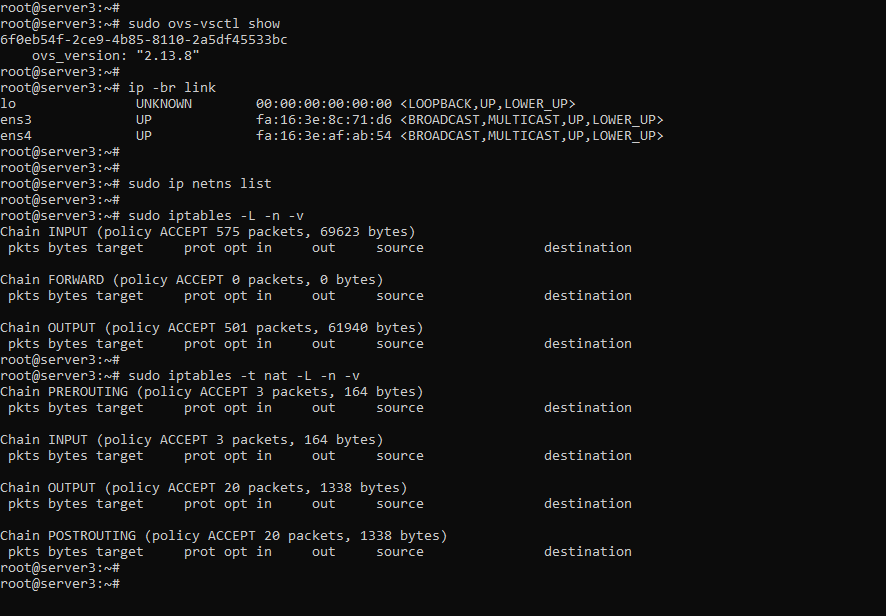

---

## 4. Resultado

Después de haber ejecutado el script `clean_up_environment.sh`, los componentes desplegados en la topologia del Laboratorio 3 fueron eliminados y los servidores quedaron limpios y preparados para iniciar el despliegue automatizado desde **Server4** de las topologías solicitadas en este Laboratorio 4.

En particular, se verificó que:

- Las VMs y sus interfaces TAP del laboratorio anterior hayan sido eliminadas.
- Los contenedores asociados a las VLAN hayan sido eliminados o verificando si aún existían.
- Los namespaces DHCP anteriores hayan sido eliminados.
- Los bridges y puertos OVS creados para la topología anterior hayan sido eliminados.
- Las reglas específicas de `iptables` hayan sido limpiadas.
- Las interfaces físicas `ens3` y `ens4` permanezcan disponibles para los siguientes despliegues.
